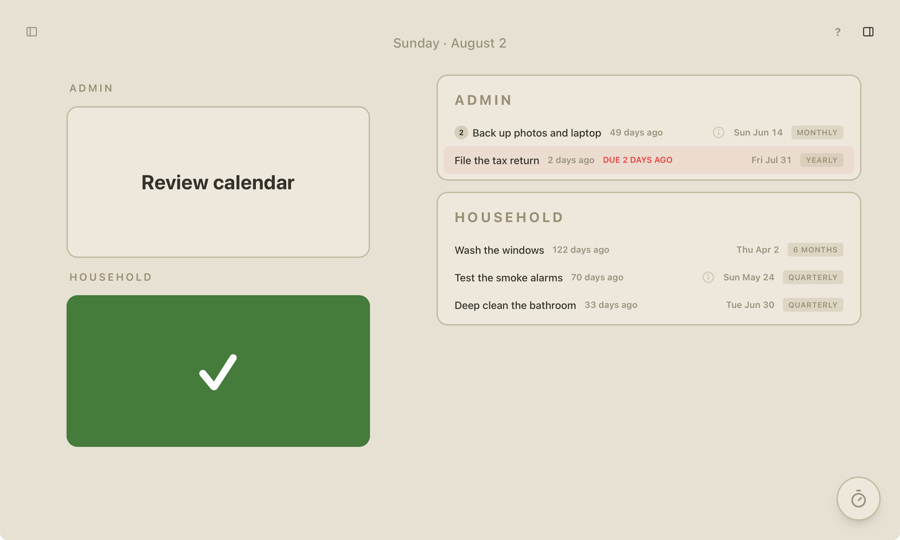

<h1>
  
  OnTop
</h1>

Keep track of your routines.

[**Live demo**](https://on-top-routines.vercel.app) · [Configuration](docs/configuration.md)

[](https://github.com/kallgren/on-top/actions/workflows/ci.yml)



## About

This is my personal tool for keeping up with my own routines. It consists of
three parts — a daily schedule, a core section of routines on a two-week
rotation, and a list of less frequent, "do when there's time" tasks.

<!-- It is built for minimal maintenance and complexity — no backend, the content lives in a GitHub gist and completions in Supabase. Requests go straight to database (ok for a personal tool with non-sensitive data, but not ideal security-wise). -->

<!-- Built for minimal maintenance, the content lives in a GitHub gist and completions
are optionally persisted cross-device in a user-supplied Supabase database. -->

Tech: [ClojureScript](https://clojurescript.org) with
[UIX](https://github.com/pitch-io/uix) over React 19,
[Tailwind CSS](https://tailwindcss.com), and
[shadow-cljs](https://github.com/thheller/shadow-cljs). Optional
[Supabase](https://supabase.com) for cross-device sync.
<!-- CI lints, format-checks, tests and release-builds on every push, then deploys a
prebuilt artifact to Vercel. -->

The app is currently not intended for public use, but you totally can use it if you want (no guarantees on future breaking changes, though!)

First, see it in action with some demo tasks [here](https://on-top-routines.vercel.app).

Then if you want to try it with your own schedule, you will need:
- A GitHub gist containing your schedule files in the proper format
- Optionally: a Supabase database table (free tier) if you want cross-device sync of your completions or just a remote backup

See [configuration](docs/configuration.md) for details.

Try it out if you'd like! And let me know how it went! Hit me up if you have any questions.

> [!NOTE]
> I use it on macOS and iOS as a PWA, and it is currently only tested on those platforms

<!-- ## Rationale

I wanted a minimal maintenance simple as possible. Landed with no backend and instead hosting the schedule on GitHub Gists and completions on a user-supplied Supabase database. Communicating straight to the database from the browser like this is of course not ideal security-wise, but ok for me since there is no sensitive data and -->

## Features

**The model**

- Three surfaces — Core, Rare and Day — separated by *posture* (your relationship to the work) rather than by how often a task recurs
- Completion tracked as **done-through** coverage rather than a "last done" date, so a task stays done across the rollover until its next occurrence
- Occurrences are derived from recurrence rules, never stored
- Categories are the top-level keys of your schedule file — rename and reorder them by editing the file, no code change
- Task names and notes live in a separate Markdown file keyed by task id, so renaming a task never touches its history

**Anti-shame by design**

- No streaks, no nagging, no ambient counts of everything outstanding
- Categories with nothing due simply don't render
- Real deadlines are the one thing allowed to shout: a Due badge on Rare, and a count on the app icon

**Offline-first**

- Installable PWA; every surface paints instantly from its last good copy, then revalidates in the background
- A compiled-in seed schedule is the floor — an unreachable gist, a missing file or invalid EDN degrades to the last good copy and logs why, never a hard failure
- Toggles made offline queue in a local outbox and reconcile on reconnect, pending winning over remote
- App-icon badge of due deadline tasks via the Badging API — no push, no service worker

**Keyboard**

- Vim/Gmail-style navigation: `hjkl` to move and cross between panes, `e` to toggle, `?` for the shortcut overlay
- One keymap as plain data drives both the bindings and the overlay that documents them, so the two can never disagree
- Panes are toggleable on wide screens and the layout persists per device

**Odds and ends**

- Built-in 30-minute focus timer that pulls up the notes for whatever you started it on
- Day rolls over when the tab returns to the foreground, not on a stale render
- Schedules are overridable at runtime from a gist — change your tasks without redeploying

## Development

Prerequisites:

- Java 21+ (e.g. `brew install --cask temurin@21`) — required by shadow-cljs 3
- [Clojure CLI](https://clojure.org/guides/install_clojure) (`clj`)
- [clj-kondo](https://github.com/clj-kondo/clj-kondo) — `brew install clj-kondo`
- [Node.js](https://nodejs.org) and [pnpm](https://pnpm.io) (e.g. `corepack enable pnpm`)

`shadow-cljs`, `tailwindcss`, `husky`, and `lint-staged` install with
`pnpm install`. `cljfmt` runs through a `deps.edn` alias, no install needed.

```bash
pnpm install
pnpm dev
```

Then open http://localhost:8080.

## Configuration

The app runs with no setup — it paints from its seed schedules and stays
purely local. To point it at your own tasks or sync completions across
devices, see [docs/configuration.md](docs/configuration.md).

## License

MIT
